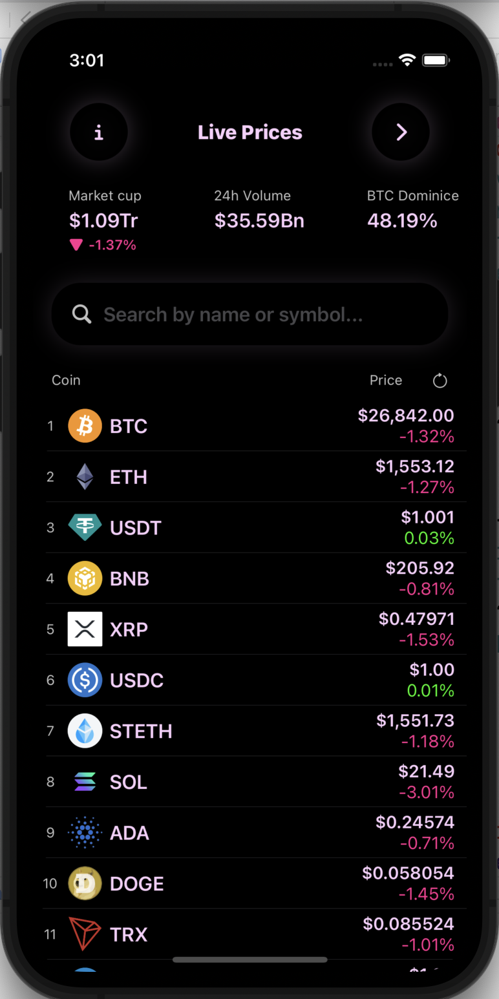
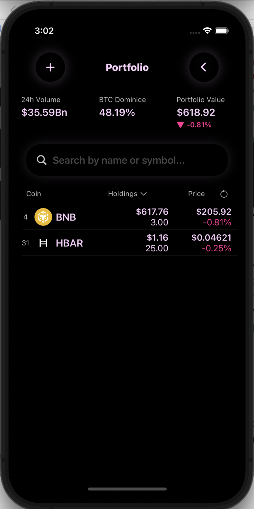
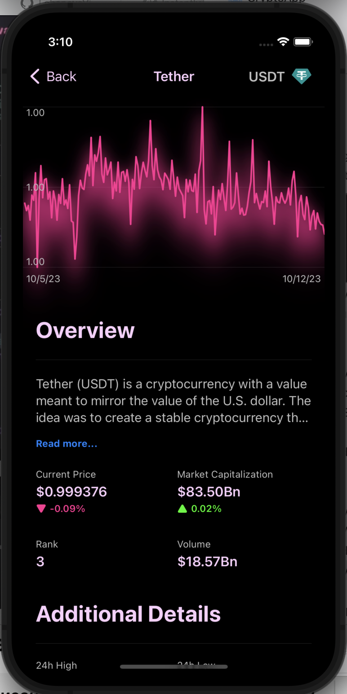
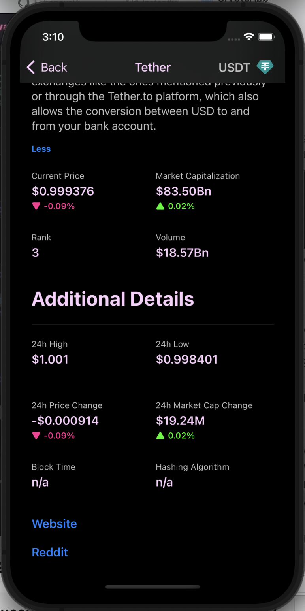
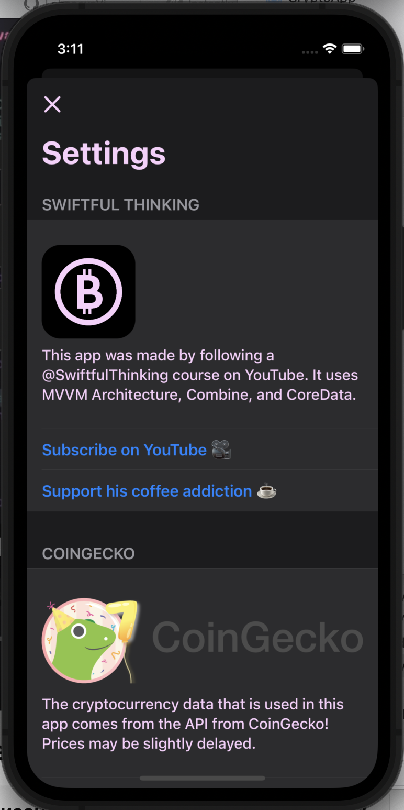
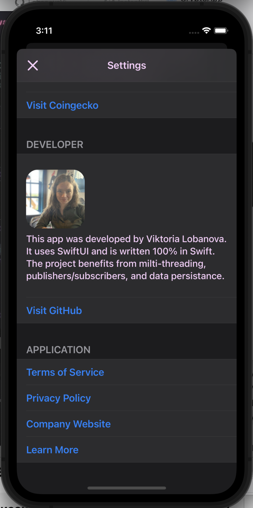

# CryptoApp
Криптовалютное приложение, которое загружает данные о ценах в реальном времени из API и использует основные данные для сохранения портфолио текущего пользователя.

# Ссылки

CoinGecko API: - [посмотреть](https://www.coingecko.com/en/api)     
CoinModel API: - [посмотреть](https://api.coingecko.com/api/v3/coins/markets?vs_currency=usd&order=market_cap_desc&per_page=10&page=1&sparkline=true&price_change_percentage=24h)   
Market Data API: - [посмотреть](https://api.coingecko.com/api/v3/global)      
Скринкаст работы приложения - [посмотреть](https://disk.yandex.ru/i/rE1xgW96hneByw)    

# Иллюстрации
  
 
 
 
 
 

# Назначение и цели приложения

Криптовалютное приложение, которое загружает данные о ценах в реальном времени из API и использует основные данные для сохранения портфолио текущего пользователя. 

Цели приложения:

- отображение текущих данных о криптовалюте
- сохранение портфолио текущего пользователя
- поиск, фильтрация, сортировка и перезагрузка данных
- пользовательская цветовая тема и анимация загрузки
